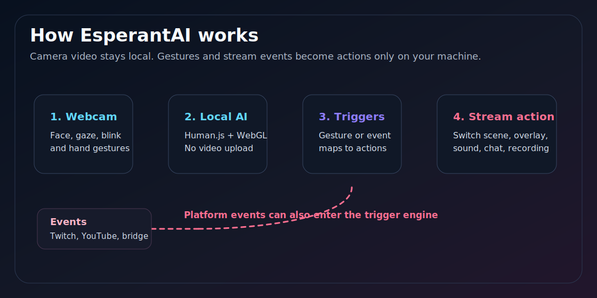
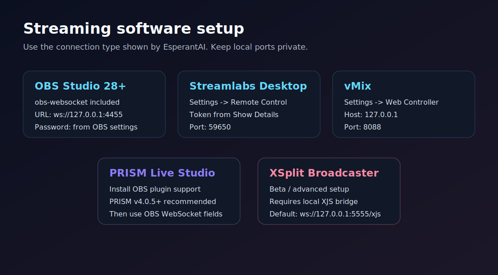
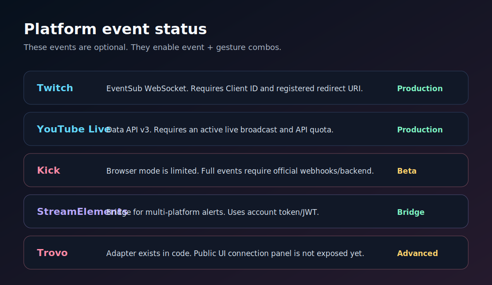
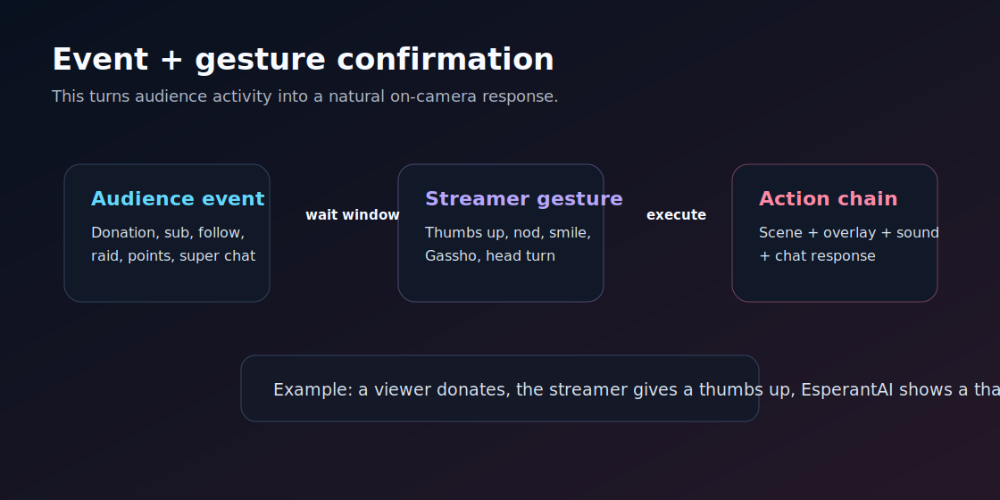

# EsperantAI — उपयोगकर्ता मैनुअल

> **ईमानदार इशारे।** अपने चेहरे और हाथों से अपने स्ट्रीमिंग सॉफ़्टवेयर को नियंत्रित करें, बिना किसी अलग समर्पित हार्डवेयर के।

**संस्करण**: 2.0 · **भाषा**: हिंदी (14 अन्य भाषाओं में भी अनुवाद उपलब्ध)

**तकनीकी सत्यापन**: OBS Studio, Streamlabs Desktop, vMix, PRISM Live Studio, XSplit, Twitch, YouTube Live, Kick, Trovo और StreamElements के लिए **20 मई 2026** तक उपलब्ध आधिकारिक दस्तावेज़ों के विरुद्ध समीक्षा की गई। विवरण: [`docs/MANUAL_PLATFORM_AUDIT_2026-05.md`](MANUAL_PLATFORM_AUDIT_2026-05.md)।

---

## विषय सूची

1. [EsperantAI क्या है?](#esperantai-क्या-है)
2. [न्यूनतम आवश्यकताएँ](#न्यूनतम-आवश्यकताएँ)
3. [खरीद और सक्रियण](#खरीद-और-सक्रियण)
4. [पहला उपयोग](#पहला-उपयोग)
5. [अपना स्ट्रीमिंग सॉफ़्टवेयर कनेक्ट करें](#अपना-स्ट्रीमिंग-सॉफ़्टवेयर-कनेक्ट-करें)
6. [इशारे और दृश्य कॉन्फ़िगर करें](#इशारे-और-दृश्य-कॉन्फ़िगर-करें)
7. [इशारों की श्रेणियाँ](#इशारों-की-श्रेणियाँ)
8. [स्ट्रीमिंग प्लेटफ़ॉर्म कनेक्ट करें](#स्ट्रीमिंग-प्लेटफ़ॉर्म-कनेक्ट-करें)
9. [इवेंट + इशारा संयोजन (उन्नत)](#इवेंट--इशारा-संयोजन-उन्नत)
10. [संवेदनशीलता और डेड ज़ोन](#संवेदनशीलता-और-डेड-ज़ोन)
11. [कीबोर्ड शॉर्टकट](#कीबोर्ड-शॉर्टकट)
12. [ट्रिगर इतिहास](#ट्रिगर-इतिहास)
13. [भाषा बदलें](#भाषा-बदलें)
14. [अपने लाइसेंस का प्रबंधन करें](#अपने-लाइसेंस-का-प्रबंधन-करें)
15. [समस्या निवारण](#समस्या-निवारण)
16. [गोपनीयता](#गोपनीयता)
17. [सहायता](#सहायता)

---

## EsperantAI क्या है?

EsperantAI एक **वेब ऐप** है जो कृत्रिम बुद्धिमत्ता का उपयोग करके आपके चेहरे और हाथों के इशारों को वास्तविक समय में पहचानता है, और उन्हें आपके स्ट्रीमिंग सॉफ़्टवेयर के लिए कमांड में बदलता है। आपके कैमरे का वीडियो स्थानीय रूप से आपके ब्राउज़र में ही संसाधित होता है।

यह इन प्रसारण कार्यक्रमों के साथ काम करता है:

- **OBS Studio** 28+
- **Streamlabs Desktop**
- **vMix**
- **PRISM Live Studio**
- **XSplit Broadcaster** (beta/advanced)

यह प्लेटफ़ॉर्म इवेंट भी प्राप्त कर सकता है और उन्हें आपके इशारों के साथ जोड़ सकता है:

- **Twitch**: EventSub WebSocket के माध्यम से सीधा समर्थन।
- **YouTube Live**: YouTube Data API v3 के माध्यम से सीधा समर्थन; active live और उपलब्ध quota आवश्यक हैं।
- **Kick**: स्थानीय **Streamer.bot bridge** के ज़रिए समर्थित; EsperantAI ब्राउज़र में Kick secrets सेव नहीं करता।
- **StreamElements**: आपके खाते के token/JWT के साथ मल्टी-प्लेटफ़ॉर्म bridge।
- **Trovo**: Trovo OAuth और आधिकारिक chat WebSocket के जरिए direct support.

### "ईमानदार इशारे" क्यों?

मूल चेहरे के भाव और सिर का घूमना **सभी मानव संस्कृतियों में सार्वभौमिक** है (पॉल एकमैन, 1972)। वे झूठ नहीं बोलते, वे भूगोल के अनुसार नहीं बदलते। EsperantAI इन्हें "🌐 सार्वभौमिक" इशारे कहता है और उन्हें "⚠️ सांस्कृतिक" इशारों (हाथ के संकेत) से अलग करता है, जिनका अर्थ देश के अनुसार भिन्न हो सकता है।

आप अपने दर्शकों के आधार पर कौन से इशारे उपयोग करने हैं, यह तय करें।

---

## न्यूनतम आवश्यकताएँ

### हार्डवेयर

- **कोई भी USB वेबकैम** (अनुशंसित: 1080p या उच्चतर)
- **CPU**: पिछले 5 वर्षों का कोई भी 4+ कोर प्रोसेसर
- **RAM**: 8 GB न्यूनतम। यदि आप एक साथ स्ट्रीमिंग कर रहे हैं तो 16 GB अनुशंसित।
- **GPU**: WebGL समर्थन वाला कोई भी (आधुनिक एकीकृत GPU भी काम करते हैं)

### सॉफ़्टवेयर

- **OS**: Windows 10/11, macOS 12+, या हालिया कर्नेल वाला Linux
- **ब्राउज़र**: Chrome 90+, Edge 90+, या Firefox 100+
- **स्ट्रीमिंग सॉफ़्टवेयर** (कम से कम एक): OBS Studio 28+, Streamlabs Desktop, vMix, PRISM, XSplit

### इंटरनेट

- अपनी **लाइसेंस सक्रिय करने** के लिए आवश्यक और हर **7 दिन** पुनः सत्यापन के लिए
- **7 दिनों तक ऑफ़लाइन** काम करता है (ग्रेस पीरियड)

---

## खरीद और सक्रियण

1. **https://edugame.digital** पर जाएँ
2. **"लाइसेंस खरीदें"** पर क्लिक करें
3. LemonSqueezy के माध्यम से भुगतान पूर्ण करें (कार्ड, PayPal, आदि)
4. आपको ईमेल प्राप्त होगा जिसमें:
   - आपकी **लाइसेंस कुंजी** (प्रारूप: `XXXX-XXXX-XXXX-XXXX-XXXX`)
   - EsperantAI उपयोग करने का लिंक
5. अपने ब्राउज़र में EsperantAI खोलें
6. सक्रियण स्क्रीन दिखाई देगी। अपनी लाइसेंस कुंजी पेस्ट करें
7. **"लाइसेंस सक्रिय करें"** पर क्लिक करें
8. हो गया! 🎉

### कितने उपकरण?

एक लाइसेंस **3 उपकरणों तक** सक्रिय किया जा सकता है। अपना लाइसेंस दूसरे उपकरण पर ले जाने के लिए:

1. पुराने उपकरण पर: **उन्नत** पैनल → **लाइसेंस** → **इस उपकरण पर निष्क्रिय करें**
2. नए उपकरण पर: सामान्य रूप से सक्रिय करें

---

## पहला उपयोग

### चरण 1: कैमरा एक्सेस की अनुमति दें

जब आप पहली बार EsperantAI खोलते हैं, तो आपका ब्राउज़र कैमरा अनुमति माँगेगा। **स्वीकार करें**।

> महत्वपूर्ण: EsperantAI आपका वीडियो किसी भी सर्वर पर नहीं भेजता। प्रसंस्करण आपके कंप्यूटर पर 100% स्थानीय है।

### चरण 2: कैमरा चुनें

यदि आपके पास एक से अधिक कैमरे हैं, तो कैमरा ड्रॉपडाउन से कौन सा उपयोग करना है चुनें।

### चरण 3: पहचान सत्यापित करें

आप बाएँ पैनल में अपना चेहरा देखेंगे। जब EsperantAI आपका चेहरा पहचान लेगा, Yaw / Pitch / Roll संकेतक मान दिखाना शुरू कर देंगे।

### चरण 4: कैलिब्रेशन विज़ार्ड (Pro+)

यदि आपके पास Pro या Pro+ लाइसेंस है, तो **कैलिब्रेशन विज़ार्ड** पहले उपयोग पर स्वचालित रूप से शुरू होता है। यह आपकी प्राकृतिक गति की सीमा को मापता है और इष्टतम संवेदनशीलता सेट करता है। आप इसे कभी भी **रीकैलिब्रेट** बटन से फिर से चला सकते हैं।

---

## अपना स्ट्रीमिंग सॉफ़्टवेयर कनेक्ट करें

इस सेक्शन के सभी कनेक्शन local हैं: EsperantAI उसी कंप्यूटर पर चल रहे प्रसारण कार्यक्रम से `127.0.0.1` के माध्यम से बात करता है।

### OBS Studio

1. OBS में: **Tools → WebSocket Server Settings**
2. WebSocket सर्वर सक्षम करें। OBS Studio 28+ में obs-websocket पहले से शामिल है।
3. EsperantAI में: **कनेक्शन** पैनल
4. स्ट्रीमिंग सॉफ़्टवेयर: **OBS Studio**
5. WebSocket URL: `ws://127.0.0.1:4455` (डिफ़ॉल्ट)
6. पासवर्ड: यदि आपने OBS में पासवर्ड सक्रिय किया है, तो वही पासवर्ड
7. **कनेक्ट** पर क्लिक करें

### Streamlabs Desktop

1. Streamlabs में: **Settings → Remote Control**
2. local Remote Control सक्षम करें
3. Remote Control स्क्रीन से **API Token** कॉपी करें
4. EsperantAI में: स्ट्रीमिंग सॉफ़्टवेयर: **Streamlabs Desktop**
5. API Token: पेस्ट करें
6. पोर्ट: `59650` (डिफ़ॉल्ट)
7. **कनेक्ट** पर क्लिक करें

### vMix

1. vMix में: **Settings → Web Controller**
2. Web Controller सक्षम करें। डिफ़ॉल्ट पोर्ट: 8088।
3. EsperantAI में: स्ट्रीमिंग सॉफ़्टवेयर: **vMix**
4. होस्ट: `127.0.0.1`
5. पोर्ट: `8088`
6. **कनेक्ट** पर क्लिक करें

> नोट: EsperantAI का मौजूदा vMix adapter local HTTP API का उपयोग करता है। यदि आपने Web Controller को network rules या browser-incompatible credentials से सुरक्षित किया है, तो connection fail हो सकता है।

### PRISM Live Studio

1. **PRISM Live Studio v4.0.5+** का उपयोग करें।
2. OBS/PRISM के साथ compatible `obs-websocket` plugin मैन्युअल रूप से install करें।
3. PRISM की official OBS plugin guide के अनुसार plugin को PRISM plugins folder में कॉपी करें।
4. PRISM पुनः आरंभ करें
5. **Tools → WebSocket Server Settings** में WebSocket सक्षम करें
6. EsperantAI में: स्ट्रीमिंग सॉफ़्टवेयर: **PRISM Live Studio** (OBS की तरह काम करता है)

> महत्वपूर्ण अंतर: OBS 28+ में obs-websocket पहले से शामिल है। PRISM में plugin manual रूप से install करना पड़ता है।

### XSplit Broadcaster (beta/advanced)

1. **XSplit XJS / Remote xjs** के साथ compatible कोई local bridge install या enable करें।
2. जाँचें कि bridge एक local WebSocket URL expose कर रहा है।
3. EsperantAI में: स्ट्रीमिंग सॉफ़्टवेयर: **XSplit**
4. Remote xjs Proxy URL: `ws://127.0.0.1:5555/xjs` (डिफ़ॉल्ट)
5. **कनेक्ट** पर क्लिक करें

> XSplit **beta/advanced** स्थिति में है। Compatibility installed local XJS bridge पर निर्भर करती है; advanced features सीमित हो सकते हैं।

---

## इशारे और दृश्य कॉन्फ़िगर करें

कनेक्ट होने के बाद, आपके सॉफ़्टवेयर के वास्तविक दृश्य स्वचालित रूप से **ट्रिगर** पैनल ड्रॉपडाउन में दिखाई देंगे।

### मूल मैपिंग

1. प्रत्येक इशारे के लिए (उदा., "बाईं ओर देखें"), ड्रॉपडाउन से एक दृश्य चुनें
2. जब आप वह इशारा करते हैं और लगभग 150ms तक स्थिर रखते हैं, तो EsperantAI आपके स्ट्रीमिंग सॉफ़्टवेयर में उस दृश्य पर स्विच करेगा
3. परिवर्तन स्वचालित और लगभग तात्कालिक है

### मल्टी-एक्शन (Pro+)

Pro या Pro+ लाइसेंस के साथ, एक इशारा **कई कार्यों** को एक साथ ट्रिगर कर सकता है:
- दृश्य बदलें + ध्वनि चलाएँ + ओवरले दिखाएँ + चैट संदेश भेजें

### श्रेणियाँ सक्षम / अक्षम करें

प्रत्येक श्रेणी का अपना "सक्षम" चेकबॉक्स है:

- 🧠 **सिर का घूमना** (सार्वभौमिक — डिफ़ॉल्ट रूप से सक्षम)
- 📏 **चेहरे की दूरी** (करीब/दूर जाएँ)
- 👁️ **दृष्टि** (केवल आँखें घुमाएँ)
- 😀 **भावनाएँ** (मुस्कान, आश्चर्य, गुस्सा, तटस्थ)
- 👁️‍🗨️ **दोहरी पलक झपकी**
- ✋ **हाथ के इशारे** (सांस्कृतिक — डिफ़ॉल्ट रूप से अक्षम)

CPU बचाने के लिए अनावश्यक श्रेणियाँ अक्षम करें।

---

## इशारों की श्रेणियाँ

### 🌐 सार्वभौमिक (किसी भी संस्कृति में समान अर्थ)

| इशारा | अक्ष | सक्रिय करने का तरीका |
|---|---|---|
| केंद्र | — | सीधे सामने देखना, चेहरा स्थिर |
| बाईं ओर देखें | नकारात्मक yaw | सिर बाईं ओर घुमाएँ |
| दाईं ओर देखें | सकारात्मक yaw | सिर दाईं ओर घुमाएँ |
| ऊपर देखें | नकारात्मक pitch | चेहरा ऊपर उठाएँ |
| नीचे देखें | सकारात्मक pitch | चेहरा नीचे करें |
| बाईं ओर झुकें | नकारात्मक roll | सिर बाएँ कंधे की ओर झुकाएँ |
| दाईं ओर झुकें | सकारात्मक roll | सिर दाएँ कंधे की ओर झुकाएँ |
| करीब आएँ | दूरी | कैमरे के करीब आएँ |
| दूर जाएँ | दूरी | कैमरे से दूर जाएँ |
| दृष्टि | दृष्टि | केवल आँखें घुमाएँ (सिर केंद्रित) |
| मुस्कुरा रहे हैं | भावना=खुशी | स्पष्ट रूप से मुस्कुराएँ |
| आश्चर्यित | भावना=आश्चर्य | आश्चर्यित दिखें |
| गुस्सा | भावना=गुस्सा | गुस्से में दिखें |
| तटस्थ | भावना=तटस्थ | विश्रामित चेहरा |
| दोहरी पलक झपकी | पलक झपकी | दोनों आँखें जल्दी दो बार बंद करें (< 700ms) |

### ⚠️ सांस्कृतिक (अर्थ देश के अनुसार भिन्न)

| इशारा | पश्चिमी अर्थ | अन्य संस्कृतियों में सावधानी |
|---|---|---|
| 👍 अंगूठा ऊपर | स्वीकृति | मध्य पूर्व / पश्चिम एशिया: आपत्तिजनक हो सकता है |
| ✌️ शांति | शांति / विजय | यूके / आयरलैंड / ऑस्ट्रेलिया (हथेली अंदर): अपमान |
| 🤘 रॉक साइन | रॉक / मेटल | इटली (हथेली नीचे): "कोर्नुटो" (अपमान) |
| 👌 ओके | ओके / परिपूर्ण | ब्राज़ील / तुर्की / जर्मनी: आपत्तिजनक हो सकता है |
| ✊ बंद मुट्ठी | राजनीतिक संदर्भ पर निर्भर | — |
| 🖐️ खुली हथेली | "रुको" या अभिवादन | ग्रीस (किसी की ओर माउंट्ज़ा): गंभीर अपमान |
| ☝️ इशारा करना | संकेत | एशिया: उंगली से इशारा करना अभद्र है |

EsperantAI UI में प्रत्येक इशारे को उसके संबंधित बैज के साथ चिह्नित करता है। अपने वैश्विक दर्शकों के आधार पर कौन से उपयोग करने हैं चुनें।

### 🙏 गश्शो (合掌)

एक विशेष इशारा: अपनी छाती के सामने दोनों हथेलियाँ एक साथ दबाएँ (प्रार्थना या अभिवादन झुकाव की तरह)। पूर्वी एशियाई संस्कृतियों में सम्मान या कृतज्ञता के संकेत के रूप में सामान्य। 6 लैंडमार्क जाँचों के साथ उच्च विश्वसनीयता से पहचाना जाता है।

---

## स्ट्रीमिंग प्लेटफ़ॉर्म कनेक्ट करें

EsperantAI को इवेंट (दान, सब्सक्रिप्शन, raids, follows या Super Chats) प्राप्त करने के लिए, उन प्लेटफ़ॉर्म को कनेक्ट करें जहाँ आप स्ट्रीम करते हैं।

### Twitch

1. https://dev.twitch.tv/console पर Client ID बनाएँ
2. रीडायरेक्ट URI पंजीकृत करें: `https://TU-DOMINIO/oauth-callback.html` (या अपना स्थानीय URL)
3. EsperantAI में: **प्लेटफ़ॉर्म इवेंट** पैनल → **Twitch EventSub**
4. अपना Client ID पेस्ट करें
5. **कनेक्ट** पर क्लिक करें
6. Twitch प्राधिकरण विंडो खुलेगी। अनुमतियाँ स्वीकार करें।
7. विंडो बंद हो जाएगी और आपको "Twitch कनेक्टेड" दिखाई देगा

EsperantAI EventSub WebSocket का उपयोग करता है। ब्राउज़र में कोई Client Secret paste न करें।

### YouTube Live

1. https://console.cloud.google.com पर क्रेडेंशियल बनाएँ
2. YouTube Data API v3 सक्षम करें
3. OAuth Client ID बनाएँ (प्रकार: वेब एप्लिकेशन)
4. Twitch के समान रीडायरेक्ट URI पंजीकृत करें
5. EsperantAI में: **प्लेटफ़ॉर्म इवेंट** पैनल → **YouTube Live**
6. अपना Client ID पेस्ट करें और **कनेक्ट** पर क्लिक करें

YouTube की आवश्यकताएँ: आपके पास chat उपलब्ध active live broadcast होना चाहिए, और आपके Google Cloud project में chat query करने के लिए पर्याप्त quota होना चाहिए।

### Streamer.bot के ज़रिए Kick

EsperantAI **Streamer.bot bridge** के ज़रिए Kick events प्राप्त करता है। यह बिक्री के लिए अनुशंसित रास्ता है क्योंकि यह ब्राउज़र में Kick secrets उजागर नहीं करता और reverse engineering पर निर्भर नहीं रहता।

1. Streamer.bot 1.0.0 या नया संस्करण इंस्टॉल करें।
2. Streamer.bot में अपना Kick account connect करें।
3. Streamer.bot में **Servers/Clients -> WebSocket Server** खोलें और server enable करें।
4. अगर आपने बदला नहीं है तो `127.0.0.1`, port `8080`, endpoint `/` इस्तेमाल करें।
5. EsperantAI में: **Platform Events** panel -> **Kick via Streamer.bot**।
6. **Connect** पर क्लिक करें।

उपलब्ध events Streamer.bot में सक्रिय Kick integration पर निर्भर करते हैं। Kick का official backend/webhook integration advanced roadmap item है।

### StreamElements (मल्टी-प्लेटफ़ॉर्म ब्रिज)

यदि आपके पास पहले से StreamElements खाता है, तो आप इसे कई platforms की alerts के लिए bridge की तरह उपयोग कर सकते हैं:

1. https://streamelements.com/dashboard/account/channels पर जाएँ
2. अपना JWT Token कॉपी करें
3. EsperantAI में: **प्लेटफ़ॉर्म इवेंट** पैनल → **StreamElements**
4. JWT पेस्ट करें और **कनेक्ट** पर क्लिक करें

इस token को private रखें। इसे अपने StreamElements खाते के password जैसा मानें।

### Trovo

EsperantAI OAuth और Trovo के official chat WebSocket के ज़रिए Trovo से connect करता है।

1. Trovo developer portal में app बनाएं।
2. उसी domain पर EsperantAI redirect URI `https://TU-DOMINIO/oauth-callback.html` register करें जहां आप app खोलते हैं।
3. EsperantAI में: **Platform Events** panel -> **Trovo**।
4. अपना Client ID paste करें और **Connect** पर क्लिक करें।
5. मांगी गई permissions authorize करें।

उपलब्ध events Trovo chat messages और official chat token flow पर निर्भर करते हैं।

---

## इवेंट + इशारा संयोजन (उन्नत)

यह EsperantAI का जादू है: **प्लेटफ़ॉर्म इवेंट** को पुष्टि के रूप में **आपके इशारों** के साथ संयोजित करना।

### उदाहरण: अंगूठा ऊपर के साथ दान का धन्यवाद करें

1. **इवेंट ट्रिगर** पैनल → "💰 दान" पंक्ति
2. ✅ सक्षम करें
3. दृश्य: `थैंक्यू_सीन`
4. आवश्यक इशारा: `👍 अंगूठा ऊपर`

**लाइव प्रवाह**:
- एक दान आता है → EsperantAI "इशारे की प्रतीक्षा..." दिखाता है
- आपके पास 👍 करने के लिए 5 सेकंड हैं
- यदि आप करते हैं → `थैंक्यू_सीन` पर स्विच करता है + कोई अन्य कॉन्फ़िगर की गई कार्रवाई चलाता है
- यदि नहीं → स्वचालित रूप से खारिज हो जाता है

### कोई आवश्यक इशारा नहीं (स्वतः-ट्रिगर)

यदि आप "आवश्यक इशारा" को `— कोई नहीं —` के रूप में छोड़ते हैं, तो इवेंट तुरंत कार्रवाई ट्रिगर करता है।

उपयोगी:
- जब रेड आते हैं तो स्वचालित रूप से उत्सव दृश्य पर स्विच करने के लिए
- जब कोई सब्सक्राइब करता है तो स्वचालित रूप से ओवरले दिखाने के लिए

---

## संवेदनशीलता और डेड ज़ोन

### संवेदनशीलता

थ्रेसहोल्ड नियंत्रित करते हैं कि ट्रिगर होने के लिए इशारा कितना बड़ा होना चाहिए:

- **Yaw**: सिर को कितना किनारे की ओर घुमाना है (डिफ़ॉल्ट: 0.15 rad ≈ 8.6°)
- **Pitch ऊपर/नीचे**: लंबवत झुकाव
- **Roll**: पार्श्व झुकाव

अधिक स्पष्ट इशारों के लिए मान बढ़ाएँ। अधिक संवेदनशीलता के लिए कम करें।

### डेड ज़ोन (थकान रोकथाम)

यदि आप लगभग केंद्रित हैं (yaw < 0.05, pitch < 0.05, roll < 0.08), तो **कुछ भी ट्रिगर नहीं होता**। यह आपको स्वाभाविक रूप से चलने की अनुमति देता है बिना माइक्रो-मूवमेंट ट्रिगर को सक्रिय किए।

### स्थिर फ़्रेम

`स्थिर फ़्रेम` = ट्रिगर होने से पहले इशारे को कितने लगातार फ़्रेम तक पकड़ना है। डिफ़ॉल्ट: 5 फ़्रेम (~150ms 30fps पर)।

यदि ट्रिगर बहुत आसानी से सक्रिय हो रहे हैं तो बढ़ाएँ। तेज़ प्रतिक्रिया के लिए कम करें।

### कूलडाउन

`कूलडाउन (ms)` = दृश्य परिवर्तनों के बीच न्यूनतम समय। डिफ़ॉल्ट: 500ms।

यदि आप जल्दी-जल्दी दिशा बदलते हैं तो स्विचर के "झटकेदार" होने से रोकता है।

---

## कीबोर्ड शॉर्टकट

| कुंजी | कार्रवाई |
|---|---|
| `Space` | पहचान रोकें / फिर से शुरू करें |
| `C` | मैन्युअल रूप से CENTRE दृश्य पर जाएँ |
| `R` | सॉफ़्टवेयर से दृश्य सूची पुनः लोड करें |
| `Esc` | डिसकनेक्ट करें |

---

## ट्रिगर इतिहास

**उन्नत → ट्रिगर इतिहास** पैनल अंतिम 50 ट्रिगर की गई कार्रवाइयाँ दिखाता है:

- ✓ हरा = सफल
- ✗ लाल = विफल
- · सलेटी = लंबित

DevTools खोले बिना क्या ट्रिगर हुआ जाँचने के लिए उपयोगी।

**CSV निर्यात**: ऑफ़लाइन विश्लेषण के लिए इतिहास डाउनलोड करें।

**साफ़ करें**: इतिहास मिटाएँ (किसी अन्य चीज़ को प्रभावित नहीं करता)।

---

## भाषा बदलें

EsperantAI स्वचालित रूप से आपके ऑपरेटिंग सिस्टम की भाषा का पता लगाता है। मैन्युअल रूप से बदलने के लिए:

- ऊपरी दाएँ कोने: भाषा ड्रॉपडाउन
- अपनी पसंदीदा भाषा चुनें
- UI तुरंत अपडेट होता है

उपलब्ध भाषाएँ:
- 🇺🇸 English
- 🇪🇸 Español (España)
- 🇲🇽 Español (México)
- 🇧🇷 Português (Brasil)
- 🇫🇷 Français
- 🇩🇪 Deutsch
- 🇯🇵 日本語
- 🇷🇺 Русский
- 🇨🇳 中文
- 🇮🇹 Italiano
- 🇵🇱 Polski
- 🇸🇦 العربية (RTL)
- 🇰🇷 한국어
- 🇮🇳 हिंदी
- 🇮🇩 Bahasa Indonesia

सभी 15 भाषाएँ मौजूदा interface files में अनुवादित हैं।

---

## अपने लाइसेंस का प्रबंधन करें

**उन्नत → लाइसेंस** पैनल:

- **स्थिति देखें**: मान्य / अमान्य
- **संबंधित ग्राहक ईमेल देखें**
- **अंतिम ऑनलाइन सत्यापन देखें**
- **इस उपकरण पर निष्क्रिय करें**: PC बदलने से पहले या एक स्लॉट खाली करने के लिए उपयोग करें (3 उपलब्ध में से)

---

## समस्या निवारण

### "सक्रियण आवश्यक" लाइसेंस कुंजी पेस्ट करने के बाद भी बना रहता है

- सत्यापित करें कि आपने पूरी कुंजी कॉपी की है (4 अक्षरों के 5 समूह डैश से अलग)
- अपना इंटरनेट कनेक्शन जाँचें (पहली बार सक्रियण के लिए ऑनलाइन सत्यापन आवश्यक है)
- यदि आपने पहले ही 3 उपकरणों पर सक्रिय किया है, तो पहले एक को निष्क्रिय करें
- यदि समस्या बनी रहती है तो soporte@edugame.digital से संपर्क करें

### "चेहरा खोज रहा है..." तब भी बना रहता है जब मेरा चेहरा दिखाई दे रहा है

- प्रकाश सुधारें: आपका चेहरा अच्छी तरह से रोशनी में होना चाहिए
- कैमरे के करीब जाएँ (40-80 cm इष्टतम है)
- GPU का उपयोग करने वाले अन्य टैब बंद करें (बहुत सारे टैब होने पर Chrome GPU को सीमित कर सकता है)
- यदि Chrome का मेमोरी सेवर सक्रिय है, तो इस टैब के लिए अक्षम करें

### दृश्य ड्रॉपडाउन में दिखाई नहीं देते

- सत्यापित करें कि आप स्ट्रीमिंग सॉफ़्टवेयर से कनेक्ट हैं (हरा बैज "कनेक्टेड")
- दृश्य सूची पुनः लोड करने के लिए `R` दबाएँ
- यदि अभी भी खाली है, तो डिसकनेक्ट करें और फिर से कनेक्ट करें
- vMix में पुष्टि करें कि Web Controller enabled है और `http://127.0.0.1:8088/api/` से reachable है
- PRISM में पुष्टि करें कि obs-websocket plugin installed और enabled है
- XSplit में पुष्टि करें कि local XJS bridge चल रहा है

### मैं इशारे किए बिना दृश्य परिवर्तन ट्रिगर होते हैं

- **संवेदनशीलता** पैनल में yaw / pitch / roll थ्रेसहोल्ड बढ़ाएँ
- `स्थिर फ़्रेम` को 5 से 8-10 तक बढ़ाएँ
- सुनिश्चित करें कि डेड ज़ोन कॉन्फ़िगर किया गया है (yaw 0.05, pitch 0.05, roll 0.08)
- जाँचें कि फ़्रेम में कोई और नहीं है (कई चेहरे अस्थिरता का कारण बन सकते हैं)

### पहचान में देरी

- भारी ऐप्स बंद करें (गेम, वीडियो एडिटिंग)
- यदि आपके पास समर्पित GPU है तो सत्यापित करें कि आप उसका उपयोग कर रहे हैं (एकीकृत नहीं)
- यदि कैमरा 4K है तो रिज़ॉल्यूशन कम करें (पहचान के लिए 1080p इष्टतम है)

### OBS प्रतिक्रिया नहीं करता जबकि EsperantAI "दृश्य बदला" कहता है

- सत्यापित करें कि ड्रॉपडाउन में दृश्य का नाम OBS में बिल्कुल मेल खाता है (केस-सेंसिटिव)
- सत्यापित करें कि दृश्य किसी अन्य Scene Collection में नहीं है
- **ट्रिगर इतिहास** पैनल जाँचें — यदि यह ✗ लाल दिखाता है, तो एक विशिष्ट त्रुटि है

### त्रुटि "OBS पहुँच योग्य नहीं — मैन्युअल रूप से कनेक्ट करें"

- सत्यापित करें कि OBS खुला है
- सत्यापित करें कि OBS में WebSocket सक्षम है
- यदि आपने OBS में पासवर्ड सेट किया है, तो यह बिल्कुल मेल खाना चाहिए
- कुछ एंटीवायरस पोर्ट 4455 को ब्लॉक करते हैं — अपवाद जोड़ें

### Twitch या YouTube कनेक्ट नहीं हो रहे

- पुष्टि करें कि platform console में redirect URI ठीक उसी `oauth-callback.html` URL से match करती है
- जिस domain पर आप EsperantAI चला रहे हैं, उसके लिए pop-up windows allow करें
- Twitch में केवल Client ID उपयोग करें; Client Secret paste न करें
- YouTube में पुष्टि करें कि YouTube Data API v3 enabled है और active live मौजूद है

### Kick Streamer.bot से connect नहीं होता

पक्का करें कि Streamer.bot 1.0.0+ खुला है, Kick Streamer.bot के अंदर connected है, और **WebSocket Server** enabled है। अगर configuration बदली नहीं है तो `127.0.0.1:8080/` इस्तेमाल करें। यदि Streamer.bot password मांगता है, वही password EsperantAI में दर्ज करें।

---

## गोपनीयता

### EsperantAI जो नहीं करता

- ❌ आपका वीडियो किसी भी सर्वर पर नहीं भेजता
- ❌ आपका वीडियो या कैप्चर संग्रहीत नहीं करता
- ❌ दूरस्थ रूप से बायोमेट्रिक जानकारी एकत्र नहीं करता
- ❌ विज्ञापनदाताओं या तृतीय पक्षों के साथ डेटा साझा नहीं करता

### जो यह प्रसंस्करित करता है

- ✅ आपके ब्राउज़र में स्थानीय चेहरा पहचान (Human.js + WebGL)
- ✅ OBS / Streamlabs / vMix / PRISM / XSplit के लिए local कनेक्शन (loopback `127.0.0.1`)
- ✅ आवधिक लाइसेंस कुंजी सत्यापन (हर 7 दिन)
- ✅ यदि आप Twitch/YouTube/Kick/StreamElements कनेक्ट करते हैं: browser के local या session storage में platform tokens

पूर्ण विवरण `docs/PRIVACY.html` में।

---

## सहायता

- 📧 ईमेल: **soporte@edugame.digital**
- 🌐 वेब: https://edugame.digital
- 📚 वेब मैनुअल: https://edugame.digital/docs/manual.html

प्रतिक्रिया समय:
- सामान्य प्रश्न: 24-72 घंटे
- तकनीकी त्रुटियाँ: 1-3 कार्य दिवस

---

*अंतिम अपडेट: 2026-05-20। संस्करण: 2.0.*
*© 2026 EdugameDigital — Joel Salazar Ramírez. EsperantAI™.*
